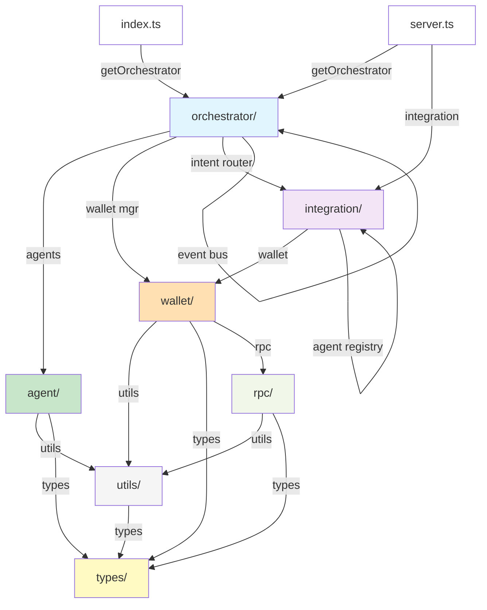

# Dependency Architecture Diagram

## Module Dependency Graph (Clean DAG)



## Layer-by-Layer Breakdown

### Layer 1: Entry Points

```
index.ts ─────┐
              ├──> getOrchestrator()
server.ts ────┘
```

### Layer 2: Orchestration

```
orchestrator/
├── orchestrator.ts (singleton: getOrchestrator)
│   ├─ dependencies: getWalletManager, getSolanaClient, getConfig
│   ├─ imports: agent/, wallet/, integration/
│   └─ exports: Orchestrator class
└── event-emitter.ts
    └─ imports: types/shared.js ONLY
```

### Layer 3: Business Logic

```
agent/ (no upward deps)
├── base-agent.ts
├── agent-factory.ts
├── strategy-registry.ts
├── accumulator-agent.ts
├── distributor-agent.ts
├── balance-guard-agent.ts
└── scheduled-payer-agent.ts

integration/ (BYOA layer - unidirectional within)
├── agentRegistry.ts (singleton: getAgentRegistry)
│   └─ imports: types/, utils/
├── walletBinder.ts (singleton: getWalletBinder)
│   └─ imports: wallet/, agentRegistry
├── intentRouter.ts (singleton: getIntentRouter)
│   └─ imports: wallet/, agent/, agentRegistry, event-emitter
├── agentAdapter.ts (singleton: getAgentAdapter)
│   └─ imports: agentRegistry, intentRouter
└── index.ts (re-exports all)
```

### Layer 4: Core Services

```
wallet/
├── wallet-manager.ts (singleton: getWalletManager)
│   └─ imports: types/, utils/, config
└── service-policy-manager.ts (singleton: getServicePolicyManager)
    └─ imports: types/, utils/, config

rpc/
├── solana-client.ts (singleton: getSolanaClient)
│   └─ imports: @solana, types/, utils/
├── transaction-builder.ts
│   └─ imports: types/, @solana
├── mpp-handler.ts
│   └─ imports: types/, utils/
└── x402-handler.ts
    └─ imports: types/, utils/
```

### Layer 5: Leaf Nodes

```
types/
├── shared.ts (frontend + backend types)
├── internal.ts (backend-only types)
└── index.ts (aggregates both)

utils/
├── config.ts (env parsing)
├── logger.ts (logging)
├── encryption.ts (AES-256)
├── store.ts (persistence)
├── error-helpers.ts
├── api-response.ts
└── types.ts (type utilities)
```

## Import Density Matrix

```
         types utils rpc  agent wallet orch  integ
────────┼────────────────────────────────────────
types   │ MAX   -    -    -     -      -     -
utils   │  ✓   MAX   -    -     -      -     -
rpc     │  ✓    ✓   MAX   -     -      -     -
agent   │  ✓    ✓    -   MAX    -      -     -
wallet  │  ✓    ✓    ✓    -    MAX    -     -
orch    │  ✓    ✓    ✓    ✓     ✓    MAX    ✓
integ   │  ✓    ✓    -    -     ✓     ✓    MAX
────────┴────────────────────────────────────────
Legend:
  ✓ = has imports from column to row
  - = no imports
  MAX = self (diagonal)
```

## Key Invariants (Maintained)

### Uni-Directionality ✅

Every non-diagonal edge in the matrix points downward or horizontally (never upward).

### No Back-References ✅

- Agent ┤ ←> Integration: only Integration uses Agent & Wallet
- Wallet ┤ ←> RPC: only RPC uses Wallet types
- Orchestrator ┤ ←> Integration: only Orchestrator calls getIntentRouter()

### Lazy Singletons ✅

All stateful services use the pattern:

```
let instance = null;
export function get*() {
  if (!instance) instance = new *();
  return instance;
}
```

### Type Safety ✅

- Cross-layer type imports use `import type { ... }` when possible
- Types are centralized in `src/types/`
- No type cycles detected

## Circular Dependency Prevention Checklist

- [x] No direct mutual imports (A ← → B)
- [x] No 2-hop cycles (A → B → A)
- [x] No 3+ hop cycles (A → B → C → A)
- [x] No initialization-time circular calls
- [x] No module-load-time getter invocations
- [x] All singletons use lazy init pattern
- [x] No circular type definitions
- [x] Event bus is decoupled (only imports types)
- [x] TypeScript compiler confirms zero cycles
- [x] No implicit dependencies through exports

## Safe Dependency Patterns Demonstrated

### ✅ Dependency Injection

```typescript
// walletBinder.ts
export class WalletBinder {
  private registry: AgentRegistry;

  constructor() {
    this.registry = getAgentRegistry(); // ← Lazy, inside constructor
  }
}
```

### ✅ Event-Driven Communication

```typescript
// intentRouter.ts
import { eventBus } from '../orchestrator/event-emitter.js';

eventBus.emit({...}); // ← No back-reference to emitter's logic
```

### ✅ Type-Only Imports

```typescript
// orchestrator.ts
import type { SupportedIntentType } from '../integration/agentRegistry.js';
// ← No runtime value import, prevents cycle

export function recordIntent(type: SupportedIntentType) { ... }
```

### ✅ Layered Architecture

```
Data Flow:    orchestrator → integration → wallet → rpc
Type Flow:    orchestrator ← integration ← wallet ← rpc
              (only for type information, not behavior)
```

---

## Recommendations for New Features

When adding new modules, ensure:

1. **Never import upward** across layer boundaries
   - ❌ agent/new-agent.ts importing orchestrator/
   - ✅ orchestrator/ importing new-agent.ts

2. **Use event-driven communication** for cross-layer signaling
   - ❌ integration/walletBinder.ts calling orchestrator.onAgentCreated()
   - ✅ integration/ emitting events via eventBus

3. **Maintain singleton pattern** for stateful services
   - ❌ Direct instantiation: `new WalletManager()`
   - ✅ Lazy singleton: getWalletManager() with internal `let instance`

4. **Centralize types** to leaf layers
   - ❌ Custom types in business logic modules
   - ✅ Types defined in types/ or constants in utils/

5. **Use dependency injection** in constructors, not module-level
   - ❌ `const registry = getAgentRegistry();` at module top
   - ✅ `this.registry = getAgentRegistry();` inside constructor

---

## Summary

The Agentic Wallet uses a **clean, layered architecture** that fundamentally prevents circular dependencies through:

1. **Directionality**: Layers import downward only
2. **Lazy initialization**: Singletons use deferred instantiation
3. **Decoupling**: Events replace direct upward calls
4. **Type centralization**: Shared types prevent circular type definitions
5. **Dependency injection**: Constructor-based rather than module-level

This architecture is **scalable and maintainable** for large, complex systems.
